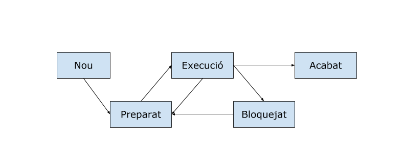

# Processos i fils

## 1. Processos

Un **procés** és una instància d'un programa en execució.
Està format per les instruccions especificades al programa i requereix uns recursos específics, com el comptador d'instruccions, el contingut dels registres o les dades.

El sistema operatiu s'encarrega de gestionar el processos.
Quan un procés es troba en execució es guarda en memòria i se li assignen els recursos que necessita.

El processador és l'encarregat d'executar les instruccions d'un procés.
En els sistemes actuals disposem de més d'un processador o més d'un nucli integrat al processador per executar diferents processos de manera simultània o concurrent.
En aquests sistemes sovint s'executen més processos que el nombre de processadors o nuclis disponibles, per tant, diferents processos s'executaran sobre un mateix processador.

La **programació paral·lela o multiprocés** s'encarrega de controlar i sincronitzar els diferents processos en execució; 
per exemple, quan un procés ha d'esperar la finalització d'un altre per continuar amb la seva tasca.
Aquest tipus de programació permet incrementar la potència de càlcul i el rendiment.

Els processos en execució poden classificar-se en:

* Processos en primer pla - mantenen una comunicació amb l'usuari
* Processos en segon pla - s'executen sense mostrar-se a l'usuari
* Serveis o dimonis (*daemon*) - no tenen interfície d'usuari, realitzen funcions sense que l'usuari ho sàpiga

## 2. Fils

Dins de cada procés podem tenir blocs d'instruccions independents, que poden executar-se a la vegada.
Aquests subprocessos s'anomenen **fils**.

A diferència dels processos, els fils comparteixen recursos (dades, codi, memòria...) d'un mateix procés; si un fil modifica una variable la resta de fils ho veuran.
Un procés estarà en execució mentre algun dels seus fils estigui actiu.

Un fil pot trobar-se en diferents estats:

* nou - es crea el fil
* preparat - es troba preparat per fer us del processador
* en execució - es troba utilitzant el processador
* bloquejat o en espera - a l'espera d'un esdeveniment
* acabat - finalitza la seva execució i allibera els recursos associats



## 3. Programació multifil

La programació multifil permet dur a terme diferents fils d'execució a la vegada, és a dir, realitzar diferents tasques en una aplicació de forma concurrent.
La majoria de llenguatges de programació permeten treballar amb fils.

En Java, la classe `Thread` gestiona l'execució de fils.
Quan comencem un programa hi ha un fil d'execució principal creat pel mètode `main()`
Aquest fil serà l'encarregat de crear la resta de fils i l'últim en acabar la seva execució.
Per crear altres fils d'execució tenim dues opcions: heretar de la classe `Thread` o implementar la interfície `Runnable`.

### 3.1. Subclasses de Thread

Podem crear diferents fils d'execució instanciant una subclasse de Thread.
El primer pas serà crear una subclasse que hereti de la classe `Thread`.
Aquesta subclasse haurà de sobreescriure el mètode `run()`, que és el que conté les instruccions a executar pel fil.

```java
public class Fil extends Thread{
    @Override
    public void run(){
        // Instruccions del fil
    }
}
```

Per crear un fil haurem d'instanciar un objecte d'aquesta subclasse i cridar al mètode `start()`, que s'encarrega d'executar el fil.

```java
Fil fil1 = new Fil();
Fil fil2 = new Fil();

fil1.start();
fil2.start();
```

[Exemple de creació de fils heretant la classe Thread](../src/fils/Fils_Herencia.java)


