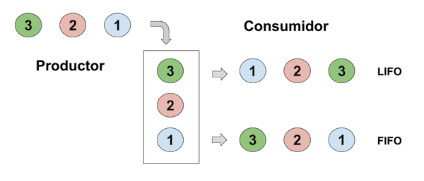

# Processos i fils

## 1. Processos

Un **procés** és una instància d'un programa en execució.
Està format per les instruccions especificades al programa i requereix uns recursos específics, com el comptador d'instruccions, el contingut dels registres o les dades.

El sistema operatiu s'encarrega de gestionar el processos.
Quan un procés es troba en execució es guarda en memòria i se li assignen els recursos que necessita.

El processador és l'encarregat d'executar les instruccions d'un procés.
En els sistemes actuals disposem de més d'un processador o més d'un nucli integrat al processador per executar diferents processos de manera simultània o concurrent.
En aquests sistemes sovint s'executen més processos que el nombre de processadors o nuclis disponibles, per tant, diferents processos s'executaran sobre un mateix processador.

La **programació paral·lela o multiprocés** s'encarrega de controlar i sincronitzar els diferents processos en execució; 
per exemple, quan un procés ha d'esperar la finalització d'un altre per continuar amb la seva tasca.
Aquest tipus de programació permet incrementar la potència de càlcul i el rendiment.

Els processos en execució poden classificar-se en:

* Processos en primer pla - mantenen una comunicació amb l'usuari
* Processos en segon pla - s'executen sense mostrar-se a l'usuari
* Serveis o dimonis (*daemon*) - no tenen interfície d'usuari, realitzen funcions sense que l'usuari ho sàpiga

## 2. Fils

Dins de cada procés podem tenir blocs d'instruccions independents, que poden executar-se a la vegada.
Aquests subprocessos s'anomenen **fils**.

A diferència dels processos, els fils comparteixen recursos (dades, codi, memòria...) d'un mateix procés; si un fil modifica una variable la resta de fils ho veuran.
Un procés estarà en execució mentre algun dels seus fils estigui actiu.

Un fil pot trobar-se en diferents estats:

* nou - es crea el fil
* preparat - es troba preparat per fer us del processador
* en execució - es troba utilitzant el processador
* bloquejat o en espera - a l'espera d'un esdeveniment
* acabat - finalitza la seva execució i allibera els recursos associats


## 3. Programació multifil

La programació multifil permet dur a terme diferents fils d'execució a la vegada, és a dir, realitzar diferents tasques en una aplicació de forma concurrent.
La majoria de llenguatges de programació permeten treballar amb fils.

En Java, la classe `Thread` gestiona l'execució de fils.
Quan comencem un programa hi ha un fil d'execució principal creat pel mètode `main()`
Aquest fil serà l'encarregat de crear la resta de fils i l'últim en acabar la seva execució.
Per crear altres fils d'execució tenim dues opcions: heretar de la classe `Thread` o implementar la interfície `Runnable`.

### 3.1. Thread

Podem crear diferents fils d'execució instanciant una subclasse de Thread.
El primer pas serà crear una subclasse que hereti de la classe `Thread`.
Aquesta subclasse haurà de sobreescriure el mètode `run()`, que és el que conté les instruccions a executar pel fil.

```java
public class Fil extends Thread{
    @Override
    public void run(){
        // Instruccions del fil
    }
}
```

Per crear un fil haurem d'instanciar un objecte d'aquesta subclasse i cridar al mètode `start()`, que s'encarrega d'executar el fil.

```java
Fil fil1 = new Fil();
Fil fil2 = new Fil();

fil1.start();
fil2.start();
```

[Exemple 1: Creació de fils heretant la classe Thread](../src/fils/Fils_Herencia.java)

### 3.2. Runnable

Java no suporta l'herència múltiple, una classe no pot heretar de més d'una classe.
Si volem crear fils que heretin d'una altra classe haurem d'utilitzar la interfície Runnable.

En aquest cas haurem de crear una classe que implementi la interfície `Runnable` i sobreescriure el mètode `run()`.

```java
public class Fils implements Runnable{
    @Override
    public void run(){
        // Instruccions del fil
    }
}
```

Per crear el fil haurem d'instanciar aquesta nova classe i crear un objecte `Thread` utilitzant la instància anterior.

```java
Fils fils = new Fils();
Thread fil1 = new Thread(fils);
Thread fil2 = new Thread(fils);
```

[Exemple 2: Creació de fils impementant la classe Runnable](../src/fils/Fils_Interficie.java)

### 3.3. Mètodes de la classe Thread

Alguns mètodes importants de la classe `Thread`:

* static Thread currentThread() - retorna el fil que s'està executant
* void setName() - assigna un nom al fil
* String getName() - retorna el nom del fil
* boolean isAlive() - indica si el fil està actiu
* void start() - deixa el fil preparat per executar-se
* void join() - atura l'execució del fil a l'espera de la finalització del fil invocat
* static void sleep(long milisegons) - atura el fil durant el nombre de mil·lisegons indicats


## 4. Sincronització de fils

### 4.1. join

El mètode `join()` de la classe `Thread` permet que un fil d'execució esperi la finalització d'un altre.
Si escrivim `fil1.join()` dins del mètode principal, aquest esperarà la finalització del fil1 abans de continuar l'execució.

Al [primer exemple](../src/fils/Fils_Herencia.java) els dos fils s'inicien simultàniament i només se sincronitzen abans de mostrar el missatge final.
Això fa que les instruccions de tots dos fils s'alternin de manera variable, en funció de la distribució que en fa el sistema operatiu.

```java
// Execució dels fils
primer.start();
segon.start();

// Sincronització del fils
primer.join();
segon.join();
System.out.println("Final de l'execució dels fils");
```

Al [segon exemple](../src/fils/Fils_Interficie.java) els fils s'executen seqüencialment. 
L'inici del segon fil espera la finalització del primer, i el missatge final espera la finalització del segon fil.
Això dóna com a resultat una execució ordenada de totes les instruccions.

```java
// Execució seqüencial dels fils
primer.start();
primer.join();

segon.start();
segon.join();

System.out.println("Final de l'execució dels fils");
```

L'exemple [Cerca.java](../src/fils/exemples/Cerca.java) mostra la utilització del mètode `join()`.
El programa troba el màxim d'un array de 1000 nombres enters.
Per fer-ho divideix l'array en 10 fragments i crea 10 fils encarregats de trobar el màxim de cada fragment;
això permet paral·lelitzar la tasca i millorar l'eficiència del programa.
El màxim de l'array es calcula com el màxim dels 10 màxims trobats per cada fil; 
però abans de calcular aquest valor cal assegurar que tots els fils han acabat la seva execució amb el mètode join.


### 4.2. sleep

El mètode `sleep(milisegons)` permet bloquejar un fil durant un temps determinat (en milisegons).
Quan passa aquest temps el fil torna a l'estat de preparat.

Es tracta d'un mètode estàtic que només bloqueja l'execució del fil que executa aquesta instrucció. 
A més, cal tenir en compte que pot llençar l'excepció `InterruptedException`.

```java
// Aturem el fil 2 segons
Thread.sleep(2000);
```

### 4.3. volatile

En Java, la paraula clau `volatile` indica al compilador que qualsevol lectura o escriptura 
sobre el valor d'una variable es faci sempre a la memòria principal i no a la memòria cau del processador. 
Això garanteix que el seu valor serà sempre visible immediatament per a tots els 
fils en execució i, per tant, que els fils sempre llegiran el seu valor més actual.
El modificador `volatile` també evita que el compilador optimitzi el codi i 
reordeni o suprimeixi instruccions sobre variables declarades com a volàtils.

Per declarar una variable com a volàtil cal indicar-ho a la seva declaració.

```java
public volatile boolean flag;
```

Cal tenir en compte que les variables de tipus `volatile` poden afectar el rendiment de 
l'aplicació, ja que les operacions on intervenen seran molt més lentes en efectuar-se
sempre sobre la memòria principal.

Les variable volàtils ens eviten llegir valors desactualitzats d'una variable, 
però no eviten problemes d'actualitzacions concurrents;
per exemple que dos fils modifiquin un valor simultàniament o 
que un fil llegeixi un valor mentre un altre el modifica.
Per evitar aquest tipus de problemes cal que aquestes operacions es realitzin de 
forma atòmica, és a dir, que no es pugui interrompre l'actualització executant 
instruccions d'altres fils. En aquestes situacions cal utilitzar els mètodes sincronitzats.


### 4.4. synchronized

El modificador `synchronized` permet marcar un mètode com a sincronitzat i protegir les dades d'un objecte d'accessos concurrents.
Quan treballem amb variables compartides és important que els accessos estiguin protegits.
Si dos fils accedeixen o modifiquen simultàniament una variable poden donar-se errors o resultats incoherents.

Els mètodes sincronitzats proporcionen exclusió mútua per accedir a un recurs compartit.
Quan un fil executa un mètode sincronitzat bloqueja l'objecte fins que acabi la seva execució.

Per marcar un mètode com a sincronitzat només cal indicar-ho a la seva declaració amb el modificador `synchronized`.

```java
public synchronized void metode(){
    //...
}
```

També pot marcar-se com a sincronitzat únicament un bloc de codi dins del mètode.

```java
public void metodeNoSincronitzat(){
    // Codi no sincronitzat
    synchronized(this){
        // Codi sincronitzat
    }
}
```

[Comptador compartit entre fils](../src/fils/Compartida_Herencia.java)

### 4.5. wait i notify

Els mètodes `wait()`, `notify()` i `notifyAll()` serveixen per a què els fils es comuniquin entre si;
permeten que un mètode esperi a un altre abans de continuar la seva execució.

* `wait()` - bloqueja un fil a l'espera de què un altre fil completi una tasca
* `notify()` - desbloqueja un dels fils en espera
* `notifyAll()` - desbloqueja tots els fils en espera

Aquests mètodes s'han de cridar sempre des d'un mètode sincronitzat.
A més, cal tenir en compte que el mètode wait pot llençar l'excepció `InterruptedException`.

Un possible esquema de treball és el següent:

```java
synchronized void metode(){
    while(!disponible){
        wait();
    }
    disponible = false;
    // Operacions atòmiques
    disponible = true;
    notify();
}

```

Un altre possible esquema és aquest:
```java
synchronized void metode(){
    while(!condicio){
        wait();
    }
    // Codi a executar quan la condició és certa
    condicio = false;
}

synchronized void canviCondicio(){
    // Codi anterior a la condició
    condicio = true;
    notify();
}
```

[Exemple d'ús dels mètodes wait() i notify()](../src/fils/activitats/Transaccions_Banc.java)

## 5. Productor-consumidor

El model productor-consumidor és un exemple clàssic de programació concurrent.
Un fil (productor) genera unes dades que han de ser processades per un altre fil (consumidor).
El consumidor ha d'esperar a tenir dades disponibles per iniciar el seu procés;
mentre que el productor ha d'esperar que hi hagi espai per a noves dades abans de desar-les.

### 5.1. Monitor

En aquest esquema, productor i consumidor només disposen d'una variable compartida per a transferir-se la informació.
El consumidor rebrà una notificació quan pugui llegir les dades i avisarà al productor que ja pot desar noves dades.
El productor rebrà la notificació, generarà noves dades, les desarà a la variable compartida i ho notificarà al consumidor.

```java
public synchronized void productor(){
    while(disponible){
        wait();
    }
    // Generació de noves dades
    disponible = true;
    notify();
}
public synchronized void consumidor(){
    while(!disponible){
        wait();
    }
    // Lectura de les dades
    disponible = false;
    notify();
}
```

[Exemple de productor-consumidor](../src/fils/ProductorConsumidor.java)

### 5.2. Pila (LIFO)

L'esquema de pila (*Last In First Out*) permet que productor i consumidor disposin de més espai per compartir informació.
En aquest cas el productor generarà noves dades mentre hi hagi espai a la pila.
El consumidor processarà les dades de la pila mentre hi hagi informació disponible i 
començant sempre per la última introduïda.

[Exemple de pila](../src/fils/ProductorConsumidor_Pila.java)



### 5.3. Cua (FIFO)

L'esquema de cua (*First In First Out*) també permet que productor i consumidor disposin de més espai per compartir informació, 
però, a diferència de la pila, les dades es processen estrictament en l'ordre d'arribada.
El productor generarà noves dades mentre hi hagi espai a la cua i el consumidor 
processarà les dades de la pila mentre hi hagi informació disponible i mantenint l'ordre d'arribada.

[Exemple de cua](../src/fils/ProductorConsumidor_Cua.java)

## 6. Recursos

* [Pràctiques de programació multifil](../activitats/PractiquesMultifil.md)
* [Classe Thread](https://docs.oracle.com/javase/8/docs/api/java/lang/Thread.html)
* [Java Memory model](http://tutorials.jenkov.com/java-concurrency/java-memory-model.html)

